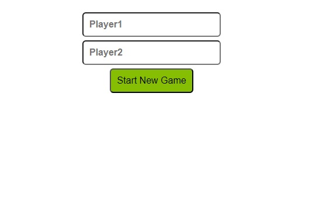
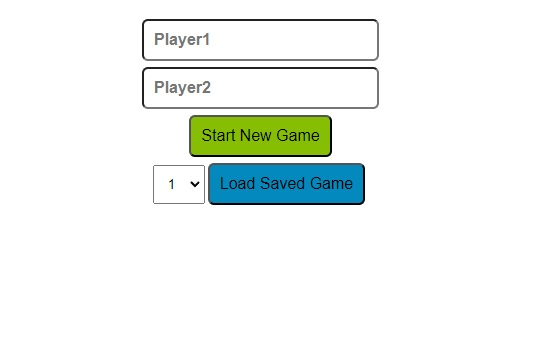
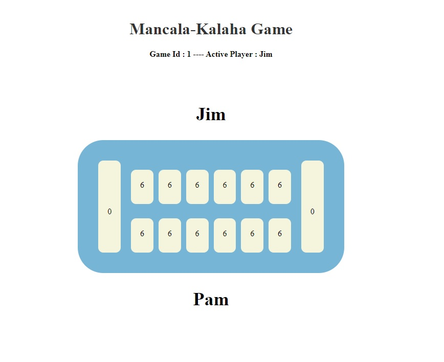
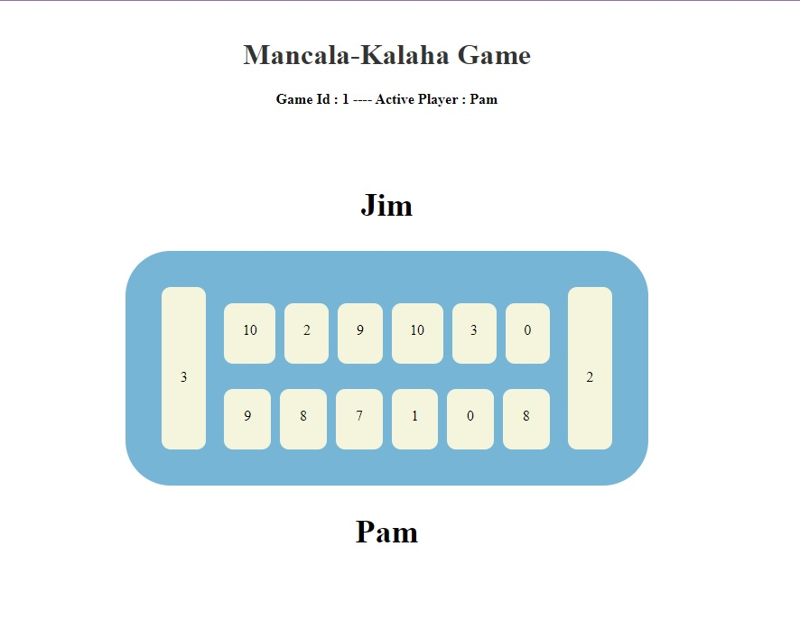
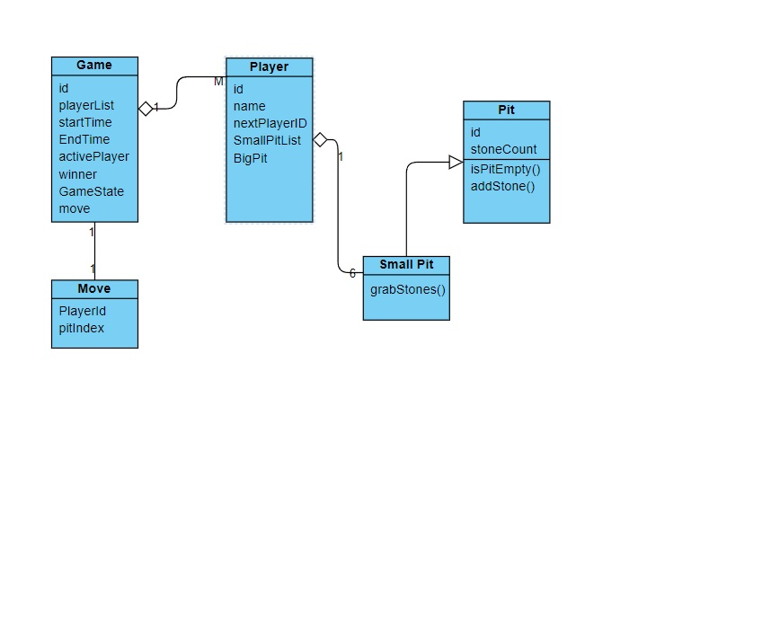
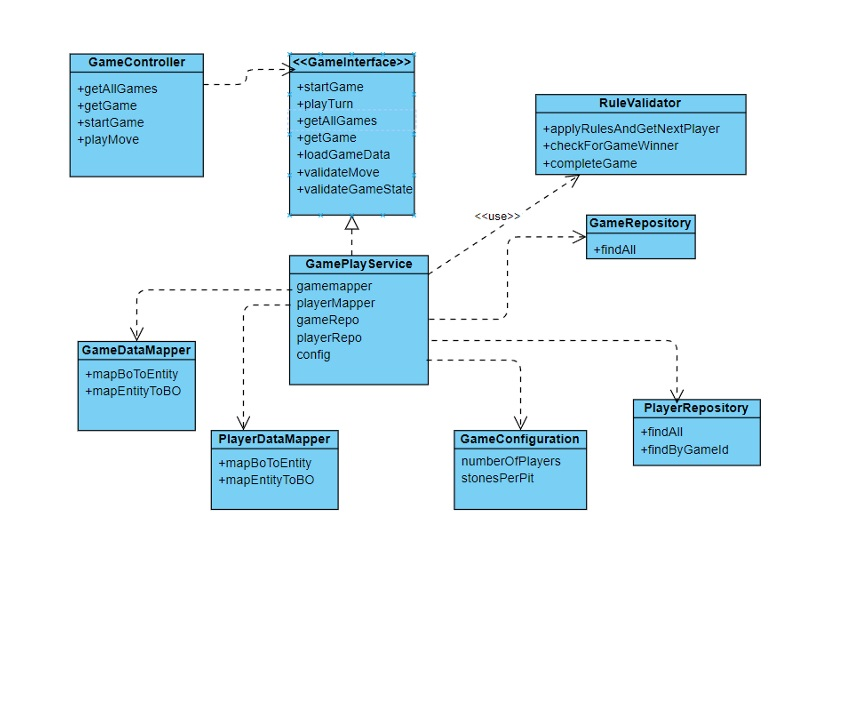
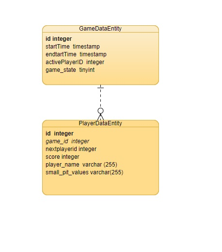

Mancala-Kalaha game:
-

Web Based  game to Play traditional Mancala/Kalaha .
The backend uses spring boot framework to expose the REST APIs for the game.
More details of the API can be explored with [Swagger](http://localhost:8080/swagger-ui/index.html) Url of application. 

Game Instructions:
-
   -load the game from  http://localhost:8080/  or the hosted url http://\<host\>:\<port\> \
   -Enter user names and start the game. \
   -You will be indicated with player who is next to play. 
    

Technologies used : 
-
  Backend :  Spring boot 3,
             Java version 17,
             Db h2 database

  Supporting tools : Swagger -Open API documentation ,             
                      Mapstruct for Dto Entity Mapping   
  Frontend: HTML,CSS,JavaScript (vanilla)

Game View :
-
Landing Page-

-

-

 
Game Board-

- 

-

Design Details :
-
Game Data model design 

-  
Game Business logic Services design -  

- 

Entity Relation Design-

-

Future enhancement scope:
-

   -  Game GUI enhancement for more readability and good user experience.
   -  Enhancement for adding Leaderboard for players who have wone the most.
   -  Ability to choose the existing players to start new Game.
   -  Introduce feature to play against computer (System as second player).
   -  Enhancement for playing 4 player mancala.

   

